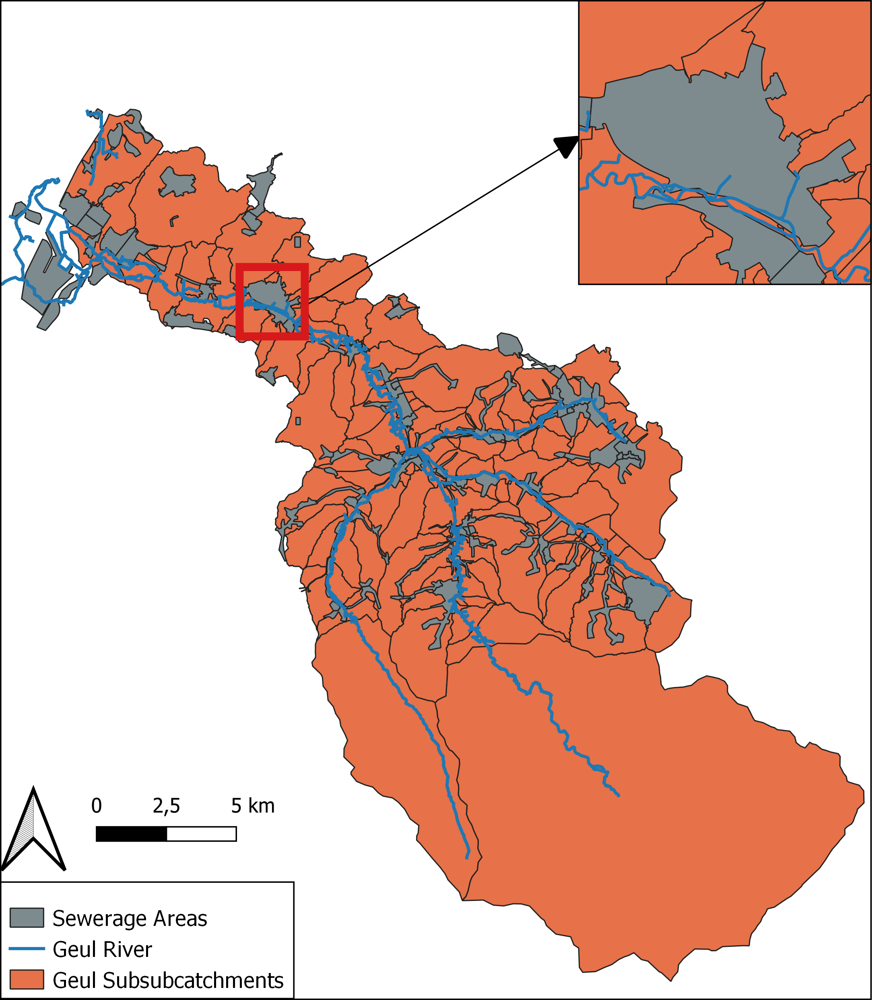
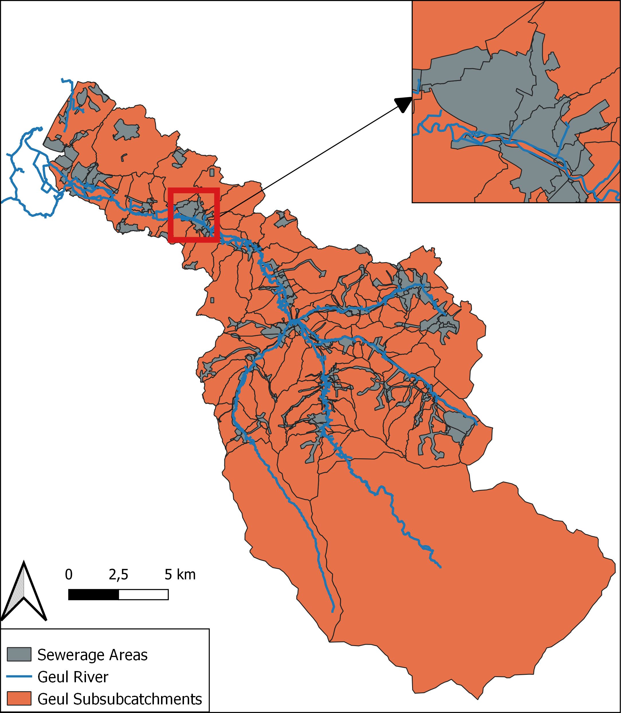

# Determine Paved and Unpaved Areas

The data of the sewerage areas and the definition of the subsubcatchments are retrieved from the Waterboard of Limburg. The sewerage areas are connected to a sewer, which is connected to the Geul river by a sewer overflow. When a sewer is full, the excess water flows via the sewer overflow in the Geul. Each sewerage area consists of paved and unpaved areas. For each sewerage area, the corresponding paved area is given in the data. However, as can be seen in, the sewerage areas intersect multiple subsubcatchments, for example in Valkenburg. Analysis is done to calculate the paved and unpaved area per subsubcatchment with a step-by-step plan and the use of the software.

