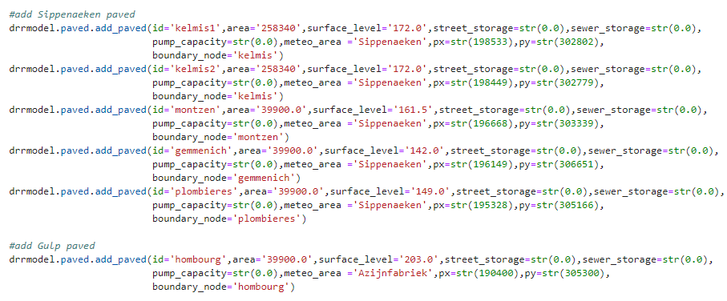
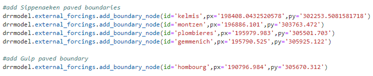
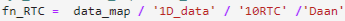
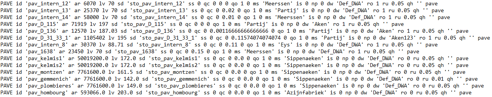
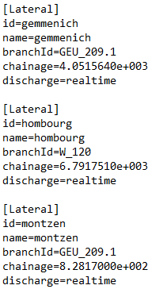
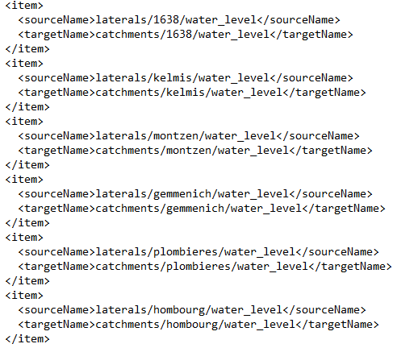
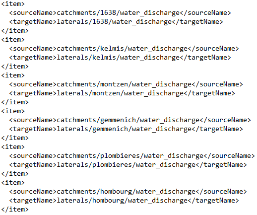

# Assign Paved Areas

This workflow show how to add the determined paved areas to D-RR. The D-HYDRO modelbuilderscript of RoyalHaskoningDHV is used for this. D-RR is a part of this modelbuilderscript. The steps are given in this section to be able to reproduce the process and to add extra villages if needed.

## Step 1: Add Villages to D-RR

The villages are added at <B><I>Stap 6: Genereren RR model</I></B> in the modelbuilderscript. This block of code generates the D-RR schematization and new paved nodes can be added. The equation <I>drrmodel.paved.add\_paved()</I> is used for this. This equation needs the following parameters:

* 'id': Name of the RR paved node;
* 'area': Paved area of the RR paved node;
* 'surface_level': The surface level of the sewer overflow;
* 'street_storage': The amount of storage on the street;
* 'sewer_storage': The amount of storage in the sewer;
* 'pump_capacity': The capacity of the pump that pumps the water to the wastewater treatment plant
* 'meteo_area': The corresponding meteo area in the .BUI file. The precipitation of this area is the input of the paved node;
* 'px': X-coordinate of the paved node;
* 'py': Y-coordinate of the paved node;
* 'boundary_node': Corresponding boundary node, at which the excess water is discharged to the river. 

The villages are added with the lines of code below. The corresponding surface levels are retrieved from the available DEM. The coordinates of the nodes are randomly chosen, close to the boundary nodes. 

  

Next, the boundary nodes are defined. These are nodes on the river, at which the excess water from the paved nodes enters the river. This is done by the equation <I>drrmodel.external\_forcings.add\_boundary\_node()</I>. The needed parameters for this equation are:

* 'id': The name of the boundary node, it should correspond with the 'boundary_node' as defined above;
* 'px': X-coordinate of the boundary node;
* 'py': Y-coordinate of the boundary node.

The boundary nodes are created by the Python code below. The boundary nodes should be on the river. It is chosen to use the coordinates of the HBV laterals as they are known. Kelmis is added at the HBV lateral 10.001_B_1, Montzen is added at 10.001_B_4, Gemmenich at 10.001_B_6, Plombieres at 10.001_B_5, and Hombourg at 13.001_B_3.

  

## Step 2: Run the modelbuilderscript

The second step is running the modelbuilderscript until <B><I>Stap 7.2: Wegschrijven FM model</I></B>. This generates a folder containing the FM and RR folders. In the RR folder, a file is generated called <I>PAVED.3B</I>. This file contains the parameters of each paved node. At <B><I>Stap 7.5: Wegschrijven RTCmodel</I></B>, the RR folder is overwritten. To avoid undoing addition of the paved nodes, an extra step is needed.

The <I>PAVED.3B</I> file is overwritten with the <I>PAVED.3B</I> file in the defined folder for RTC in the figure below. This file should be adjusted to contain the added villages. This is done by copying the lines that contain the new paved nodes from the <I>PAVED.3B</I> in the generated folder, the last five lines in the figure shown below, to the <I>PAVED.3B</I> file in the RTC folder.

  

  

When the file is adjusted, the last step <B><I>Stap 7.5: Wegschrijven RTCmodel</I></B> can be run. This generates the correct and final version of the D-RR schematization.

## Step 3: Copy D-RR to your D-HYDRO Model

The created D-RR schematization can be used in your D-HYDRO model. The RR folder can be copied to the folder that contains the D-HYDRO model. 

## Step 4: Adjust PAVED.3B

The parameters of the paved nodes can be adjusted if needed. The defined storages can be adjusted, the pumpcapacity can be changed or the surface level can be modified. Another adjustable parameter is the runoff delay factor (ru in the figure above). This factor delays the flow from the paved node to the river. The larger the distance between the paved node and the river, the smaller the runoff delay coefficient.

## Step 5: Adjust Geul\_v1.03\_feb\_2022\_new.ext

The file <B><I>Geul\_v1.03\_feb\_2022\_new.ext</I></B> combines the external forcings or boundary conditions. This file connects the boundary condition type, the name of the boundary condition and the file containing the timeseries. Boundary conditions are for example water levels, laterals, and meteorological fields. The created paved nodes are new boundary conditions and have to be added to the external forcing file. This is done by the adding lines shown below.

  

The lateral discharge is defined by:

* 'id': Id of the lateral discharge;
* 'name': Name of the lateral discharge;
* 'branchId': Branch on which the lateral discharge is located;
* 'chainage': Location on the branch of the point-lateral discharge [m];
* 'discharge': Prescribed discharge for the lateral.

In this case, the discharge is set to realtime, as it is computed at every timestep during the D-HYDRO run.

## Step 6: Adjust dimr\_config.xml

The final step is adjusting the Deltares Integrated Model Runner (DIMR) file. The DIMR file couples the FM, RR, and RTC modules. The boundary nodes need to be added in two ways. First, the lines under the heading <I><coupler name="flow\_to\_rr"></I> are added, as in left figure below. These lines pass the water level in the FM model to the paved nodes in D-RR. Next, the lines in the right figure below are added under the heading <I><coupler name="rr\_to\_flow"></I>. With these lines, the generated discharge of the paved nodes in D-RR is passed to the FM module. The adjusted model is now ready for simulation.

  
  

