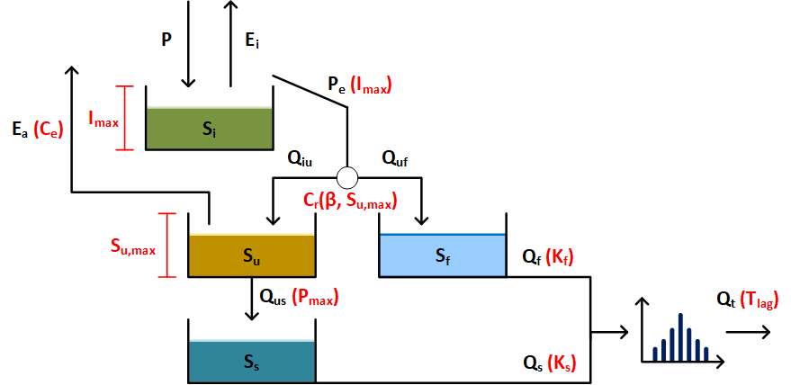

# HBV
This folder contains the used semi-distributed HBV model, build by Hrachowitz (2021). 

## Files
- HBVMod.py contains the semi-distributed HBV model for hourly timesteps and returns the modelled discharge
- HBVMod_cal.py can be used for calibrating the HBV model. The function returns the objective and logobjective. These are 1 - Nash-Shutcliff coefficient, for the modelled discharge and the logarithm of the modelled discharge.
- Weighfun.py contains the transformation function of the HBV model. The discharge is spread out of Tlag timesteps. 
- HBV_run.py contains a run of the complete Geul catchment, with calibrated parameters by Thewissen (2022).

# References
Hrachowitz, M. (2021). Lecture 2 - Flow Paths 2021. Technical University Delft. Retrieved 13-09-2023, from https://brightspace.tudelft.nl/d2l/le/content/399298/viewContent/2298342/View
Thewissen, A. (2022). Flood event of July 2021: How extreme were the floods in the Ahr, Vesdre andGeul? Retrieved 13-09-2023, from http://resolver.tudelft.nl/uuid:a7436524-e11b-4922-8637-6a74a1868f04
