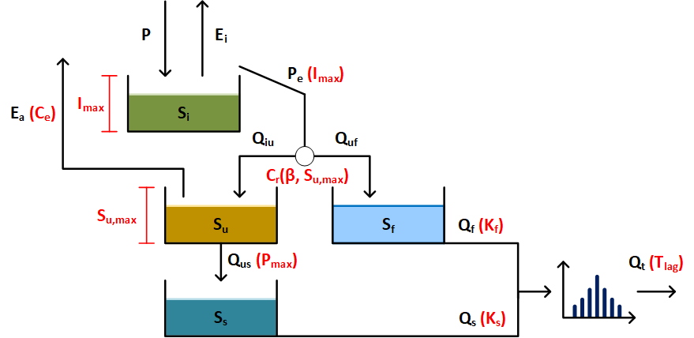

# HBV
This folder contains the used semi-distributed HBV model, build by Hrachowitz (2021). 

The basic modelling interface (bmi) is applied to the semi-distributed HBV model.

The package bmipy is required to run the code, https://github.com/csdms/bmi-python.

## Files

# References
Hrachowitz, M. (2021). Lecture 2 - Flow Paths 2021. Technical University Delft. Retrieved 13-09-2023, from https://brightspace.tudelft.nl/d2l/le/content/399298/viewContent/2298342/View
