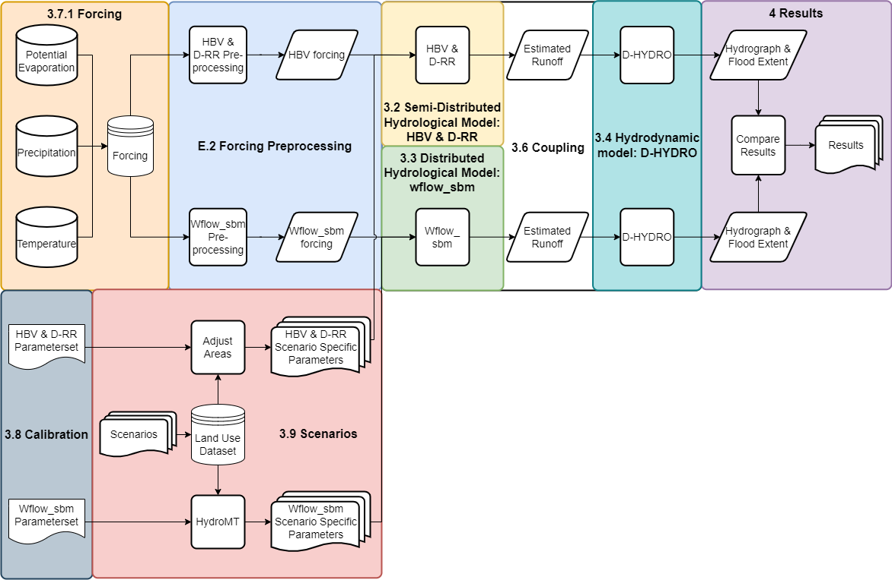

# Safely Building New Houses in the Geul Catchment: How to mitigate the impact on flooding?

This repository contains the used Jupyter Notebooks and scripts during the Msc Thesis of (bron). The goal of this research is to investigate the best suitable subcatchment for the construction of new residential houses for the Geul catchment, in terms of flooding. By doing so, the housing shortage and the letter Water en Bodem Sturend are linked for this catchment. The July 2021 flood event is used as a reference for this research. The first step was investigating the hydrological response of the Geul catchment.
Secondly, this hydrological response was modelled by the semi-distributed hydrological models HBV and D-RR and by the distributed model Wflow_sbm. HBV and D-RR are set up in this research and Wflow_sbm is adopted from Klein (2022) and Bouaziz (2022). The hydrological models are coupled to the Geul D-HYDRO model of Hulsman et al. (2023). Thereafter, the building plans in the Geul catchment were investigated and scenarios were constructed. Lastly, these scenarios were simulated by the hydrological models.

## Method

The method of this research is defined by:

  

The corresponding Jupyter Notebooks and scripts can be found in this repository. The results of this research can be reproduced by the Notebooks in the folders A, B, and C. More information is given in these folders on the specific notebooks within that step. The location of the blocks in the overview are as follows:

* Forcing: A) Preparation - 3) Forcing
* Forcing Preprocessing: A) Preparation - 3) Forcing - 2) Processing
* Semi-Distributed Hydrological Model:
  * HBV: Models - HBV
  * D-RR: Models - D-HYDRO
* Distributed Hydrological Model: Models - Wflow_sbm
* Hydrodynamic Model: Models - D-HYDRO
* Coupling: B) Scenariobuilding - 7) Couple Laterals
* Calibration: A) Preparation - 5) Calibration
* Scenarios: B) Scenariobuilding
* Results: C) Evaluation

# References

Bouaziz, L. (2022). <I>Samenvatting Wflow Geul</I>

Hulsman, R., Weijers, L., Verstegen, E., & Goedbloed, A. (2023). <I>Modelbouw D-HYDRO Geul</I>. Royal HaskoningDHV

Klein, A. (2022). <I>Hydrological Response of the Geul Catchment to the Rainfall in July 2021. </I>
